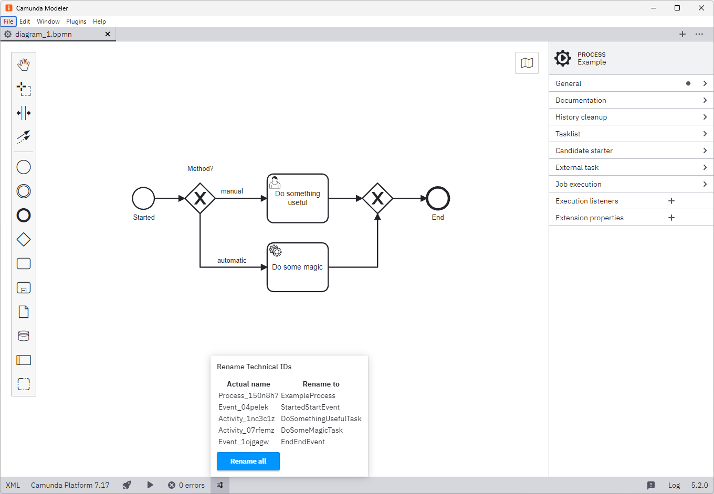

# Camunda Modeler - Rename Technical IDs

[](https://github.com/camunda/camunda-modeler) [](#)

*Have a large BPMN process and want to automate it? Are you annoyed about editing all technical IDs manually?*

Then this is the right plugin for you. This plugin helps you to generate and rename technical IDs for all BPMN symbols:

e.g.:
- StartEvent_050orni with name Payload received becomes `PayloadReceivedStartEvent`
- UserTask_0eyj290 with name Process data becomes `ProcessDataTask`
- ...

The generated IDs suite to our best practice.



## How to use

1. Download and copy this repository into the `plugins` directory of the Camunda Modeler
2. Start the Camunda Modeler
3. Open an existing BPMN process or create a new one
4. Open overlay and rename all IDs at once
5. If the name starts with a number (it is an invalid QName), the ID will start with a `N`: Time event with 10 Days will become `N10DaysEvent`

Refer to the [plugins documentation](https://github.com/camunda/camunda-modeler/tree/master/docs/plugins#plugging-into-the-camunda-modeler) to get detailed information on how to create and integrate Camunda Modeler plugins.

## Development Setup

Firstly, clone this repository to your machine
```bash
$ git clone https://github.com/Xembalo/camunda-modeler-plugin-rename-technical-ids.git
$ cd camunda-modeler-plugin-rename-technical-ids
```

Install all dependencies

```bash
$ npm install
```

To work properly inside the Camunda Modeler, this plugin needs to be bundled.

```bash
$ npm run all
```

## Compatibility Notice

This plugin is currently compatible with Camunda Modeler 5.x versions.

## Resources

* [Camunda Modeler plugins documentation](https://docs.camunda.io/docs/components/modeler/desktop-modeler/plugins/)

## License

MIT

